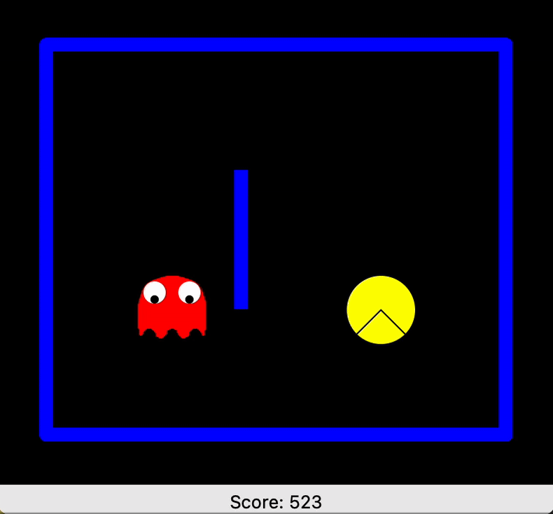

# Q - Learning and Q - Approximate Pakkuman Agent

## Features
Reinforcement Learning, Q Learning, Q Approximate, Lru Cache, Exploration Function, Temporal Difference, Bellman Equation, Living Reward and Living Penalty

## Q Approximate Pakkuman
When grid is very large, it will be hard to maintain the Q table dictionary, also it's harder to generalize, which means for a two similiar (state, action) pairs, it's difficult to utilize the result with already learned one into new one. Therefore, we utilized feature function, similar to regression, with coef (weight) and feature, using temporal difference to appromixate Q value with functionality of generalization and update the weight coef by iteration:

```
Δ = R + γ V(s') - Q(s,a)
w_i = w_i + α * Δ * f_i(s, a)
Q(s,a) = w_1 * f_1(s,a) + w_2 * f_2(s,a) + ... + w_n * f_n(s,a)

# f_n feature extraction
@lru_cache(maxsize=10)
def simple_extractor(state, action):
    features = {'bias': int, 'ghost-step-away': boolean, 'food': int, 'closest-food': int}
```
where Δ is TD, R is current reward, γ is discount factor, α is learning factor, f is feature extraction value

lru_cache is used here to improve memory efficiency, and the feature dict is formed with if agent is nearby ghost and the distance between food and agent. Instead of updating Q value, weight coef is updated by iteration. Training is about 100 times in order to let agent learn enough information and perform well



**Pakkuman agent with ghost and food**

## GridWorld Q Learning
Utilized Bellman Equation to update Q, V and best policy under a gridworld non-determinstic environment by iteration. Every time the environment will start with start point and use iteration to keep updating the Q value for every (state, action) pair

```
V(s) = max_a Q(s,a)
π(s) = argmax_a Q(s,a)
Q(s,a) = (1 - α) Q(s,a) + α (R + γ V(s'))
```
where α is learning rate, γ is discount rate, s' is next state

Instead of regular Q function, an improved version with mix up exploration function `Q(s, a) + u / k+1)` is used here, where u is bonus coef to determine the magnitude for bonus of unexplored node, and k is equal to visited count for current (state, action) pair.
For exploration probability , `random.random() < self.explore_prob` is applied for pure random action selection in order to avoid the case that agent never explore some state and remain on sub-optimal solution. A Exploration vs. Exploitation tradeoff is balanced in this case.


**GUI for gridworld Q agent with action**

### Run Argument
In order to run Q learning agent, run `python gridworld.py`, with optional argument below:
- `grid`: Selects the grid layout preset (`book`, etc.).
- `--discount (-d)`: Sets the discount factor γ for future rewards.
- `--noise (-n)`: Adds stochasticity by defining the probability of noisy action outcomes.
- `--living-reward (-l)`: Reward received at each non-terminal step.
- `--learning-rate (-r)`: Q-learning update rate α.
- `--epsilon (-e)`: Exploration probability ε in ε-greedy strategy.
- `--iteration (-i)`: Sets the starting iteration number for training.

### Run Argument
In order to run default position feature, run `python pacman.py --agent approx --train 2000 --play 10 small`
In order to run simple feature approximate, run `python pacman.py --agent approx --feature simple --train 100 --play 10 medium`
with custom argument below

- `layout`: Specifies the map layout preset (e.g., `small`, `medium`).
- `--agent (-a)`: Chooses the agent type: `'q'` for table-based, `'approx'` for approximate.
- `--feature (-f)`: Selects the feature extractor (`identity` or `simple`) for the approximate agent.
- `--discount (-d)`: Sets the discount factor γ to control future reward weighting.
- `--learning-rate (-r)`: Learning rate α for Q-value updates.
- `--epsilon (-e)`: Exploration rate ε used in ε-greedy action selection.
- `--train (-t)`: Number of episodes to train the agent.
- `--play (-p)`: Number of episodes to evaluate the learned policy (no learning happens).

